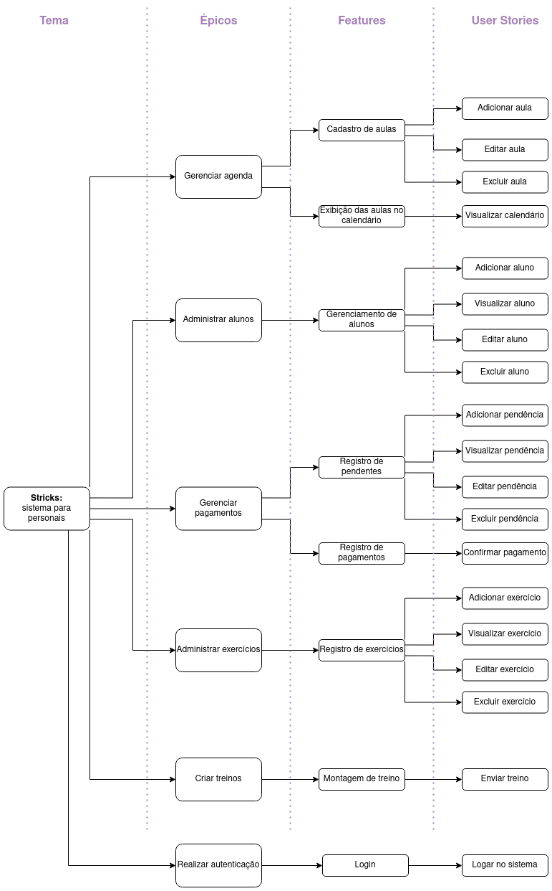

# Documento de requisitos

 

## Histórico de revisão:

| Data     | Versão | Descrição                                                                                 | Autor                            |
|----------|--------|-------------------------------------------------------------------------------------------|----------------------------------|                                  
| 30/11/22 | 0.1    | Criação do documento e introdução | Pedro, Mário, Israel
| 30/11/22 | 0.2    | Elaboração do diagrama, elicitação dos requisitos funcionais | Beatriz
| 01/12/22 | 0.3    | Elicitação dos requisitos não-funcionais e criação do rascunho dos User Stories | Guilherme, Pedro
| 04/12/22 | 0.4    | Revisão dos User Stories e elaboração de seus Critérios de Aceite  | Beatriz
| 06/12/22 | 0.5    | Documentação dos MVPs  | Mário
| 07/12/22 | 0.6    | Re-organização do diagrama e refatoração dos requisitos funcionais  | Pedro

## 1. Introdução

Este documento tem como objetivo apresentar uma descrição detalhada dos requisitos do STRIX, sistema de gerenciamento para Personal Trainers. Por meio deste documento, o cliente tomará conhecimento das funcionalidades do projeto e os desenvolvedores terão uma noção de como implementar tais funcionalidades.

### 1.1 Objetivos

Dentre os objetivos deste documento estão o de listar, de forma mais clara possível, os requisitos funcionais e não funcionais do sistema em questão.

### 1.2 Escopo

O presente documento visa ser escrito de forma abrangente e clara, para que possa ser utilizado por todos os membros da equipe responsável, e também compreendido pelo cliente. Serão abordados os requisitos funcionais com base na classificação do SAFe framework, e os requisitos não-funcionais com base na classificação FURPS+.

 

## 2. Requisitos

Esta seção apresenta em detalhe os requisitos elicitados de acordo com as estruturas de classificação especificadas acima.

### 2.1 Requisitos Funcionais

Os requisitos funcionais estão organizados hierarquicamente na estrutura de Épicos, Features e User Stories. Para sua rastreabilidade, o ID é dado no formato X.Y.Z, com X o ID do épico, Y o ID da feature, e Z o ID da user story. A organização dos requisitos se deu com base na elaboração do seguinte diagrama de hierarquia:

#### 2.1.1 Épicos

| ID    	| Nome                   	|
|-------	|------------------------	|
| 1.0.0 	| Gerenciar Agenda       	|
| 2.0.0 	| Administrar Alunos     	|
| 3.0.0 	| Gerenciar Pagamentos   	|
| 4.0.0 	| Administrar Exercícios 	|
| 5.0.0 	| Autenticar Usuário        |

#### 2.2.2 Features

| ID    	| Nome                            	|
|-------	|---------------------------------	|
| 1.1.0 	| Cadastro de aulas               	|
| 1.2.0 	| Exibição de aulas no calendário 	|
| 2.1.0 	| Gerenciamento de alunos         	|
| 3.1.0 	| Registro de pendentes           	|
| 3.2.0 	| Registro de pagamentos          	|
| 4.1.0 	| Registro de exercícios          	|
| 4.2.0 	| Registro de treino             	|
| 5.1.0 	| Login                           	|

#### 2.2.3 User Stories

| ID    	| Nome                  	| Descrição                                                                                                                                 	| Critérios de aceite                                                                                                                                                                                                                                                                                                                                                          	|
|-------	|-----------------------	|-------------------------------------------------------------------------------------------------------------------------------------------	|------------------------------------------------------------------------------------------------------------------------------------------------------------------------------------------------------------------------------------------------------------------------------------------------------------------------------------------------------------------------------	|
| 1.1.1 	| Adicionar aula        	| Eu como personal, Quero adicionar uma aula, Para lembrar-me mais tarde.                                                             	| Deve abrir o formulário para preenchimento da data, hora, duração, nome da aula e seleção de alunos; Deve permitir apenas a inclusão de alunos cadastrados no sistema; Deve permitir a não inclusão de alunos (campo não obrigatório); Não deve permitir a marcação de aulas com choque de horário (levando em consideração a hora de início e sua duração).        	|
| 1.1.2 	| Editar aula           	| Eu como personal, Quero editar uma aula registrada, Para alterar algum dado.                                                        	| Deve permitir editar todos os dados da aula (data, hora, duração, nome da aula e alunos); Não deve seguir os mesmos critérios de inclusão - não permitir marcação com choque de horários e inclusão de alunos não registrados)                                                                                                                                            	|
| 1.1.3 	| Excluir aula          	| Eu como personal, Quero excluir uma aula registrada, Para retirar um compromisso que não existe mais.                               	| Deve realizar a exclusão da aula selecionada após a confirmação da exclusão por meio de modal; Deve retirar a aula excluída do calendário.                                                                                                                                                                                                                                	|
| 1.2.1 	| Visualizar calendário 	| Eu como personal, Quero visualizar no calendário as aulas que tenho marcadas, Para organizar meus compromissos.                     	| Deve listar as aulas registradas no calendário, cada dia deve conter as aulas marcadas em ordem crescente de horário; Deve mostrar apenas as aulas que ainda irão acontecer, não deve aparecer as dos dias passados;                                                                                                                                                      	|
| 2.1.1 	| Adicionar aluno       	| Eu como personal, Quero adicionar um aluno, Para gerenciar suas aulas e pagamentos.                                                 	| Deve abrir o formulário para preenchimento dos dados do aluno contendo nome completo, data de nascimento, telefone, CPF e email; Deve exibir máscara nos campos de data, telefone e CPF; Deve realizar a validação do CPF e da data que não pode ser superior a atual; Não deve permitir a inclusão de alunos com o mesmo CPF; Todos os campos são obrigatórios. 	|
| 2.1.2 	| Visualizar aluno      	| Eu como personal, Quero visualizar os meus alunos, Para obter a listagem de todos eles.                                             	| Deve permitir a visualização da lista de alunos adicionados;                                                                                                                                                                                                                                                                                                                 	|
| 2.1.3 	| Editar aluno          	| Eu como personal, Quero editar os dados de um aluno, Para os manter sempre atualizados.                                             	| Deve permitir a edição dos dados do aluno, com exceção do CPF; Os campos devem seguir as mesmas regras de inclusão do aluno quanto as validações, máscaras e obrigatoriedade.                                                                                                                                                                                             	|
| 2.1.4 	| Excluir aluno         	| Eu, como usuário, desejo remover do sistema um aluno previamente adicionado, para lidar com a desistência de alunos.                      	| Deve permitir a exclusão do aluno selecionado após a confirmação da exclusão por meio de modal; Deve retirar o aluno excluído do calendário.                                                                                                                                                                                                                              	|
| 3.1.1 	| Adicionar pendência   	| Eu como personal, Quero adicionar uma pendência, Para estar sempre ciente dos pagamentos a serem feitos.                            	| Deve permitir adicionar uma pendência de pagamento ao preencher os campos de valor, data de vencimento, tĩtulo, aluno e status. Deve permitir adicionar apenas 1 aluno já registrado; Deve exibir a máscara nos campos de valor e data; O status pode ser “em aberto” ou “pago”.                                                                                    	|
| 3.1.2 	| Visualizar pendência  	| Eu como personal, Quero visualizar as pendências de pagamento, Para me organizar financeiramente.                                   	| Deve listar todas as pendências cadastradas;                                                                                                                                                                                                                                                                                                                                 	|
| 3.1.3 	| Editar pendência      	| Eu com personal, Quero editar uma pendência registrada, Para manter a mesma atualizada.                                             	| Deve permitir editar todos os dados da pendência; Os campos devem seguir as mesmas regras da inclusão de pendência.                                                                                                                                                                                                                                                       	|
| 3.1.4 	| Excluir pendência     	| Eu como personal, Quero excluir uma pendência, Para caso a pendência não exista mais.                                               	| Deve permitir excluir a pendência após a confirmação por meio de modal; Deve retirar a pendência da listagem.                                                                                                                                                                                                                                                             	|
| 3.2.1 	| Confirmar pagamento   	| Eu como personal, Quero confirmar o pagamento, Para saber que a pendência foi paga.                                                 	| Deve permitir mudar o status da pendência para “pago”; Deve alterar o status na listagem.                                                                                                                                                                                                                                                                                 	|
| 4.1.1 	| Adicionar exercício   	| Eu, como usuário, desejo criar um novo exercício e adicioná-lo ao sistema, para poder cadastrar os exercícios que eu enviarei aos alunos. 	| Deve permitir adicionar um exercício ao preencher os campos de nome e descrição.                                                                                                                                                                                                                                                                                             	|
| 4.1.2 	| Visualizar exercício  	|  Eu, como usuário, desejo visualizar os dados de um exercício, para verificar se as instruções estão corretas.                            	| Deve permitir editar todos os dados do exercício e salvá-lo.                                                                                                                                                                                                                                                                                                                 	|
| 4.1.3 	| Editar exercício      	| Eu, como usuário, desejo editar os dados de um exercício, para poder acrescentar ou remover instruções.                                   	| Deve permitir editar todos os dados do exercício e salvá-lo.                                                                                                                                                                                                                                                                                                                 	|
| 4.1.4 	| Excluir exercício     	| Eu, como usuário, desejo remover do sistema um exercício previamente cadastrado, para não instruir mais este exercício aos alunos.        	| Deve permitir excluir o exercício selecionado após confirmação pelo modal; Deve retirar o exercício excluído da listagem.                                                                                                                                                                                                                                                 	|
| 4.2.1 	| Enviar treino         	| Eu, como usuário, desejo selecionar múltiplos exercícios, para definir o treino de um aluno.                                              	| Deve permitir a criação do treino por meio da seleção de exercícios e do aluno a recebê-lo.  Cada exercício deve ter associado a ele o preenchimento da quantidade de repetições e um campo de observações; Deve permitir incluir qualquer quantidade de exercícios; Deve enviar o treino ao email do aluno selecionado;                                            	|
| 5.1.1 	| Logar no sistema      	| Eu, como usuário, desejo me autenticar no sistema com meu user e senha, para poder utilizar das funcionalidades do sistema.                    	| Deve permitir realizar o login por meio do preenchimento de usuário e senha; Não deve permitir o login caso alguma informação esteja incorreta; O login deve expirar após 12 horas de inatividade, exigindo uma nova autenticação.                                                                                                                                     	|
| 5.1.2 	| Alterar senha      	| Eu, como usuário, desejo redefinir a minha senha de login, para me autenticar novamente caso eu a esqueça.                    	| Deve permitir a redenifição de uma nova senha e confirmá-la; Não deve permitir mais de uma alteração no período de 12 horas;                                                                                                                                     	|

 

### 2.2 Requisitos Não-Funcionais

| ID    | Categoria       | Descrição                                                                                                                                             | 
|-------|-----------------|-------------------------------------------------------------------------------------------------------------------------------------------------------|
| RNF01 | Implementação   | A API do sistema deve ser desenvolvida em NodeJS e se conectar a um banco de dados Postgres.                                                          |
| RNF02 | Implementação   | O front-end do sistema deve ser desenvolvido em NextJS.                                                                                               |
| RNF03 | Suportabilidade | O sistema web e todas as suas funcionalidades devem ser suportadas pelas últimas versões dos browsers modernos (Chrome, Firefox, Edge, Safari, Opera) |

## 3. MVP

### 3.1 MVP 1

| User Story| Sprint |
|----|----|
| [2.1.1] Adicionar aluno | Sprint 4 |
| [2.1.2] Visualizar aluno | Sprint 4  |
| [2.1.4] Excluir aluno | Sprint 4 |
| [4.1.1] Adicionar exercício | Sprint 5 |
| [4.1.2] Visualizar exercício | Sprint 5 |
| [4.1.4] Excluir exercício | Sprint 5 |

### 3.2 MVP 2

| User Story | Sprint |
| ---- | ---- |
| [2.1.3] Editar aluno | Sprint 6 |
| [4.1.4] Editar exercício | Sprint 6 |
| [1.1.1] Adicionar aula | Sprint 6 |
| [1.1.2] Editar aula | Sprint 6 |
| [1.1.3] Excluir aula | Sprint 6 |
| [3.1.1] Adicionar pendência | Sprint 7 |
| [3.1.2] Visualizar pendência | Sprint 7 |
| [3.1.3] Editar pendência | Sprint 7 |
| [3.1.4] Excluir pendência | Sprint 7 |
| [1.2.1] Visualizar calendário | Sprint 7 |
| [3.2.1] Confirmar pagamento | Sprint 7 |
| [5.1.1] Enviar treino | Sprint 7 |
| [6.1.1] Logar no sistema | Sprint 7 |
