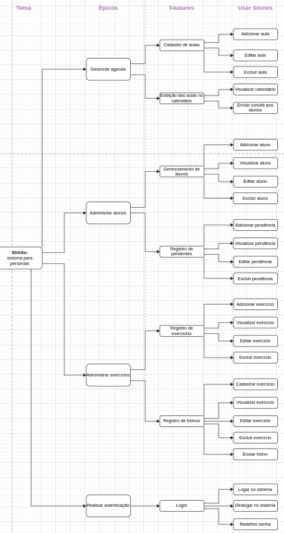

# Documento de requisitos

## Histórico de revisão:

| Data     | Versão | Descrição                                                                                 | Autor                            |
|----------|--------|-------------------------------------------------------------------------------------------|----------------------------------|                                  
| 30/11/22 | 0.1    | Criação do documento e introdução | Pedro, Mário, Israel
| 30/11/22 | 0.2    | Elaboração do diagrama, elicitação dos requisitos funcionais | Beatriz
| 01/12/22 | 0.3    | Elicitação dos requisitos não-funcionais e criação do rascunho dos User Stories | Guilherme, Pedro
| 04/12/22 | 0.4    | Revisão dos User Stories e elaboração de seus Critérios de Aceite  | Beatriz
| 06/12/22 | 0.5    | Documentação dos MVPs  | Mário
| 07/12/22 | 0.6    | Re-organização do diagrama e refatoração dos requisitos funcionais  | Pedro
| 19/12/22 | 0.7    | Alterações nos requisitos não-funcionais e remoção de textos desnecessários.  | Pedro
| 09/01/23 | 0.8    | Atualização do diagrama  | Mário
| 09/01/23 | 0.9    | Correção referente a issue #10 e ajustes referentes ao novo diagrama | Beatriz
| 11/01/23 | 1.0    | Ajustes no MVP1 | Pedro
| 31/01/23 | 1.1    | Ajustes sugeridos pelo outro grupo em sala de aula | Beatriz

## 1. Introdução

Este documento tem como objetivo apresentar os requisitos do STRIX, sistema de gerenciamento para Personal Trainers. Por meio deste documento, o cliente tomará conhecimento das funcionalidades do projeto e os desenvolvedores terão uma noção de como implementar tais funcionalidades.

### 1.1 Objetivos

Dentre os objetivos deste documento estão o de listar os requisitos funcionais e não funcionais do sistema em questão.

### 1.2 Escopo

Serão abordados os requisitos funcionais com base na classificação do SAFe framework, e os requisitos não-funcionais com base na classificação FURPS+.

## 2. Requisitos

Esta seção apresenta os requisitos elicitados de acordo com as estruturas de classificação especificadas acima.

### 2.1 Requisitos Funcionais

Os requisitos funcionais estão organizados hierarquicamente na estrutura de Épicos, Features e User Stories. Para sua rastreabilidade, o ID é dado no formato X.Y.Z, com X o ID do épico, Y o ID da feature, e Z o ID da user story. A organização dos requisitos se deu com base na estrutura do SAFe.

#### 2.1.1 Épicos

| ID    	| Nome                   	|
|-------	|------------------------	|
| 1.0.0 	| Gerenciar Agenda       	|
| 2.0.0 	| Administrar Alunos     	|
| 3.0.0 	| Administrar Exercícios 	|
| 4.0.0 	| Realizar Autenticação   |

#### 2.2.2 Features

| ID    	| Nome                            	|
|-------	|---------------------------------	|
| 1.1.0 	| Cadastro de aulas               	|
| 1.2.0 	| Exibição de aulas no calendário 	|
| 2.1.0 	| Gerenciamento de alunos         	|
| 2.2.0 	| Registro de pendentes           	|
| 3.1.0 	| Registro de categoria             | 
| 3.2.0   | Registro de exercícios           	|
| 3.3.0 	| Registro de treinos             	|
| 4.1.0 	| Login                           	|

#### 2.2.3 User Stories

|   ID  |            Nome           |                                                                      Descrição                                                                      |                                                                                                                                                                        Critérios de aceite                                                                                                                                                                       |
|:-----:|:-------------------------:|:---------------------------------------------------------------------------------------------------------------------------------------------------:|:----------------------------------------------------------------------------------------------------------------------------------------------------------------------------------------------------------------------------------------------------------------------------------------------------------------------------------------------------------------:|
| 1.1.1 | Adicionar aula            | Eu como personal, Quero adicionar uma aula, Para lembrar-me mais tarde.                                                                             | Deve abrir o formulário para preenchimento da data, hora, duração, nome da aula e seleção de alunos; Deve permitir a não inclusão de alunos (campo não obrigatório); Não deve permitir a marcação de aulas com choque de horário (levando em consideração a hora de início e sua duração).     |
| 1.1.2 | Editar aula               | Eu como personal, Quero editar uma aula registrada, Para alterar algum dado.                                                                        | Deve permitir editar todos os dados da aula (data, hora, duração, nome da aula e alunos); Não  deve seguir os mesmos critérios de inclusão - não permitir marcação com  choque de horários e inclusão de alunos não registrados)                                                                                                                                 |
| 1.1.3 | Excluir aula              | Eu como personal, Quero excluir uma aula registrada, Para retirar um compromisso que não existe mais.                                               | Deve retirar a aula excluída do calendário.                                                                                                                                                                                                                       |
| 1.2.1 | Visualizar calendário     | Eu como personal, Quero visualizar no calendário as aulas que tenho marcadas, Para organizar meus compromissos.                                     | Deve listar as aulas registradas no calendário, cada dia deve conter as aulas marcadas em ordem crescente de horário; Deve mostrar apenas as aulas que ainda irão acontecer, não deve aparecer as dos dias passados;                                                                                                                                             |
| 1.2.2 | Enviar convite aos alunos | Eu como personal,  Quero enviar o convite de aula ao aluno,  Para que ele receba o mesmo em seu próprio calendário e possa se planejar para a aula. | Deve realizar o envio de convite da aula ao calendário do email do(s) aluno(s) registrado(s) naquela aula.                                                                                                                                                                                                                                                       |
| 2.1.1 | Adicionar aluno           | Eu como personal, Quero adicionar um aluno, Para gerenciar suas aulas e pagamentos.                                                                 | Deve abrir o formulário para preenchimento dos dados do aluno contendo nome completo, data de nascimento, telefone, CPF e email; Deve exibir máscara nos campos de data, telefone e CPF; Deve realizar a validação do CPF e da data que não pode ser superior a atual; Não deve permitir a inclusão de alunos com o mesmo CPF; Todos os campos são obrigatórios. |
| 2.1.2 | Visualizar aluno          | Eu como personal, Quero visualizar os meus alunos, Para obter a listagem de todos eles.                                                             | Deve permitir a visualização da lista de alunos adicionados;                                                                                                                                                                                                                                                                                                     |
| 2.1.3 | Editar aluno              | Eu como personal, Quero editar os dados de um aluno, Para os manter sempre atualizados.                                                             | Deve permitir a edição dos dados do aluno, com exceção do CPF; Os campos devem seguir as mesmas regras de inclusão do aluno quanto as validações, máscaras e obrigatoriedade.                                                                                                                                                                                    |
| 2.1.4 | Excluir aluno             | Eu, como personal, desejo remover um aluno previamente adicionado, para lidar com a desistência de alunos.                                           | Deve permitir a exclusão do aluno selecionado após a confirmação da exclusão por meio de modal; Deve retirar o aluno excluído do calendário.                                                                                                                                                                                                                     |
| 2.2.1 | Adicionar pendência       | Eu como personal, Quero adicionar uma pendência, Para estar sempre ciente dos pagamentos a serem feitos.                                            | Deve permitir adicionar uma pendência de pagamento ao preencher os campos de valor, data de início, descrição e aluno. Deve permitir adicionar apenas 1 aluno já registrado; Deve exibir a máscara nos campos de valor e data.                                                                                 |
| 2.2.2 | Visualizar pendência      | Eu como personal, Quero visualizar as pendências de pagamento, Para me organizar financeiramente.                                                   | Deve listar todas as pendências cadastradas exibindo os campos de valor, data de início, descrição e aluno referente;                                                                                                                                                                                                                                                                                                                     |
| 2.2.3 | Editar pendência          | Eu com personal, Quero editar uma pendência registrada, Para manter a mesma atualizada.                                                             | Deve permitir editar todos os dados da pendência; Os campos devem seguir as mesmas regras da inclusão de pendência.                                                                                                                                                                                                                                              |
| 2.2.4 | Excluir pendência         | Eu como personal, Quero excluir uma pendência, Para caso a pendência não exista mais.                                                               | Deve permitir excluir a pendência após a confirmação por meio de modal; Deve retirar a pendência da listagem.                                                                                                                                                                                                                                                    |
| 3.1.1 | Adicionar categoria       | Eu como personal, Quero adicionar uma categoria, Para poder vincular os exercícios a ela classificando-os.                                          | Deve permitir adicionar uma categoria  ao preencher os campos de nome e descrição. Ambos os campos são de preenchimento obrigatórios.                                                                                                                                                                                                                            |
| 3.1.2 | Visualizar categoria      | Eu como personal, Quero visualizar as categorias cadastradas, Para conferir se elas estão corretas ou se necessitam de alteração.                   | Deve permitir a visualização da lista de categorias adicionadas.                                                                                                                                                                                                                                                                                                 |
| 3.1.3 | Excluir categoria         | Eu como personal, Quero excluir uma categoria cadastradas, Para não aparecer mais nas opções de seleção.                                            | Deve permitir excluir a categoria selecionada após confirmação pelo modal;  Deve retirar a categoria excluída da listagem.                                                                                                                                                                                                                                       |
| 3.2.1 | Adicionar exercício       | Eu, como personal,  Quero criar um novo exercício,Para poder cadastrar os exercícios que eu enviarei aos alunos.                                     | Deve permitir adicionar um exercício ao preencher os campos de nome, repetições, duração, categoria e observação;  Todos os campos devem ser obrigatórios.                                                                                                                                                                                                       |
| 3.2.2 | Visualizar exercício      | Eu, como personal,  Quero visualizar os dados de um exercício, Para verificar se as instruções estão corretas.                                       | Deve permitir editar todos os dados do exercício e salvá-lo.                                                                                                                                                                                                                                                                                                     |
| 3.2.3 | Editar exercício          | Eu, como personal, Quero editar os dados de um exercício, Para poder modificar alguma instrução.                                                     | Deve permitir editar todos os dados do exercício e salvá-lo.                                                                                                                                                                                                                                                                                                     |
| 3.2.4 | Excluir exercício         | Eu, como personal, Quero remover do sistema um exercício previamente cadastrado, Para não instruir mais este exercício aos alunos.                   | Deve retirar o exercício excluído da listagem de exercícios.                                                                                                                                                                                                                                        |
| 3.3.1 | Adicionar treino          | Eu, como personal, Quero criar um novo treino e adicioná-lo ao sistema, Para poder guardá-los e enviar mais facilmente aos alunos.                   | Deve permitir criar um treino ao selecionar os exercícios desejados e escrever o nome do treino;  É obrigatório selecionar ao menos um exercício e escrever o nome.                                                                                                                                                                                              |
| 3.3.2 | Visualizar treino         | Eu como personal, Quero visualizar os treinos prontos, Para analisar qual irei enviar ao meu aluno.                                                 | Deve listar todos os treinos cadastrados.                                                                                                                                                                                                                                                                                                                        |
| 3.3.3 | Editar treino             | Eu como personal, Quero editar um treino, Para manter o mesmo atualizado.                                                                          | Deve permitir editar os dados do treino; Os campos devem seguir as mesmas regras da inclusão do treino.                                                                                                                                                                                                                                                          |
| 3.3.4 | Excluir treino            | Eu como personal, Quero excluir um treino, Para caso ele não sirva mais.                                                                            | Deve permitir excluir o treino após a confirmação por meio de modal; Deve retirar o treino da listagem.                                                                                                                                                                                                                                                          |
| 3.3.5 | Enviar treino             | Eu, como personal, Quero selecionar um treino, Para enviá-lo a um aluno.                                                                             | Deve permitir o envio do treino por meio da seleção do mesmo e do(s) aluno(s) a recebê-lo;  Deve enviar o treino ao e-mail do(s) aluno(s) selecionado(s);                                                                                                                                                                                                        |
| 4.1.1 | Logar no sistema          | Eu, como personal, Quero que o sistema possua autenticação, Para a segurança dos dados contidos nele.                                                | Deve permitir realizar o login por meio do preenchimento de usuário e senha; Não deve permitir o login caso alguma informação esteja incorreta; O login deve expirar após 1 mês de realizado, exigindo uma nova autenticação.                                                                                                                                    |
| 4.1.2 | Deslogar no sistema       | Eu como personal, Quero deslogar do sistema, Para que os dados dos alunos continuem protegidos ao mudar de computador.                               | Deve deslogar o usuário e voltar à tela de login.                                                                                                                                                                                                                                                                                                                |
| 4.1.3 | Alterar senha             | Eu, como personal, Quero redefinir a minha senha de login, Para me autenticar novamente caso eu a esqueça.                                           | Deve permitir a redenifição de uma nova senha e confirmá-la após a pergunta de segurança ser respondida com sucesso;                                                                                    |

###  2.2 Requisitos Não-Funcionais

| ID    | Categoria       | Descrição                                                                                                                                             | 
|-------|-----------------|-------------------------------------------------------------------------------------------------------------------------------------------------------|
| RNF01 | Implementação   | A API do sistema deve ser desenvolvida em NodeJS.                                                          |
| RNF02 | Implementação   | A API do sistema deve se conectar a um banco de dados Postgres.                                                                                       |
| RNF03 | Implementação   | O front-end do sistema deve ser desenvolvido em NextJS.
| RNF04 | Suportabilidade | O sistema web e todas as suas funcionalidades devem ser suportadas pelas últimas versões dos browsers modernos (Chrome v107 ou superior, Firefox v108 ou superior) |

## 3. MVP: Minimum Viable Product

### 3.1 MVP 1

#### 3.1.1 Versão Inicial (desatualizado)

| User Story                   | Sprint   |
|------------------------------|----------|
| [2.1.1] Adicionar aluno      | Sprint 4 |
| [2.1.2] Visualizar aluno     | Sprint 4 |
| [2.1.3] Editar aluno         | Sprint 4 |
| [2.1.4] Excluir aluno        | Sprint 4 |
| [4.1.1] Adicionar exercício  | Sprint 5 |
| [4.1.2] Visualizar exercício | Sprint 5 |
| [4.1.4] Editar exercício     | Sprint 5 |
| [4.1.4] Excluir exercício    | Sprint 5 |
| [4.2.1] Enviar treino        | Sprint 5 |

#### 3.1.2 Versão Final

| User Story                   |  Sprint  |
|------------------------------|:--------:|
| [2.1.1] Adicionar aluno      | Sprint 4 |
| [2.1.2] Visualizar aluno     | Sprint 4 |
| [2.1.3] Editar aluno         | Sprint 4 |
| [2.1.4] Excluir aluno        | Sprint 4 |
| [4.1.1] Logar no sistema     | Sprint 4 |
| [4.1.2] Deslogar no sistema  | Sprint 4 |
| [3.2.1] Adicionar exercício  | Sprint 5 |
| [3.2.2] Visualizar exercício | Sprint 5 |
| [3.1.1] Adicionar categoria  | Sprint 5 |
| [3.3.1] Adicionar treino     | Sprint 5 |
| [3.3.2] Visualizar treino    | Sprint 5 |

### 3.2 MVP 2

#### 3.2.1 Versão inicial (desatualizado)

| User Story                   | Sprint   |
|------------------------------|----------|
| [1.1.1] Adicionar aula       | Sprint 6 |
| [1.1.2] Editar aula          | Sprint 6 |
| [1.1.3] Excluir aula         | Sprint 6 |
| [3.1.1] Adicionar pendência  | Sprint 6 |
| [3.1.2] Visualizar pendência | Sprint 6 |
| [3.1.3] Editar pendência     | Sprint 6 |
| [3.1.4] Excluir pendência    | Sprint 6 |
| [3.2.1] Confirmar pagamento  | Sprint 7 |
| [5.1.1] Logar no sistema     | Sprint 7 |
| [5.1.2] Alterar senha        | Sprint 7 |

#### 3.2.2 Versão 2

| User Story | Sprint |
| ---- | ---- |
| [3.2.3] Editar exercício | Sprint 5 |
| [3.2.4] Excluir exercício | Sprint 5 |
| [3.3.5] Enviar treino | Sprint 5 |
| [1.1.1] Adicionar aula | Sprint 6 |
| [1.1.2] Editar aula | Sprint 6 |
| [1.1.3] Excluir aula | Sprint 6 |
| [2.2.1] Adicionar pendência | Sprint 6 |
| [2.2.2] Visualizar pendência | Sprint 6 |
| [2.2.3] Editar pendência | Sprint 6 |
| [2.2.4] Excluir pendência | Sprint 6 |
| [4.1.3] Alterar senha | Sprint 7 |
