# Entregas
## 1 Entrega da unidade 1

### 1.1 Links
|  |  |
|----|----| 
| Video de apresentação do documento de visão do produto e projeto | [link](https://www.youtube.com/watch?v=EjtqzDgSy_w) |
| Material do seminário de processos e ciclos de vida (espiral) | [link](https://docs.google.com/presentation/d/1UiUgiFNUzba7ayCEBlZnpJ7UEB7uvV8o4FU8TWKbIn4/edit#slide=id.gc6f90357f_0_47) |

### 1.2 Material do Seminário de Processos e Ciclos de Vida

1. 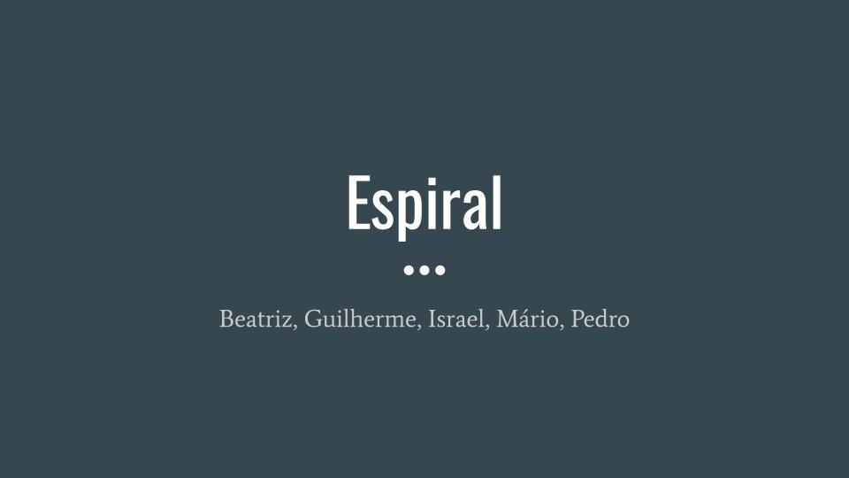
2. 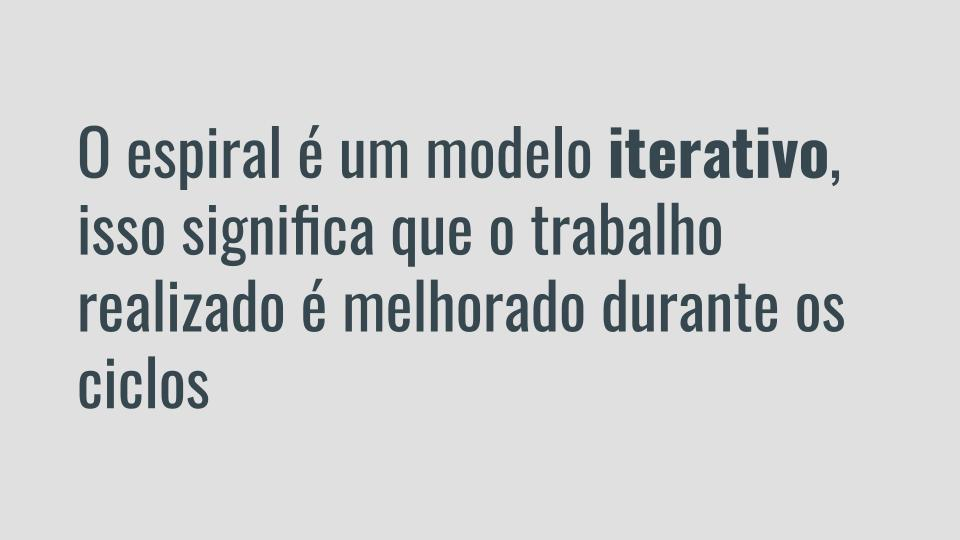
3. 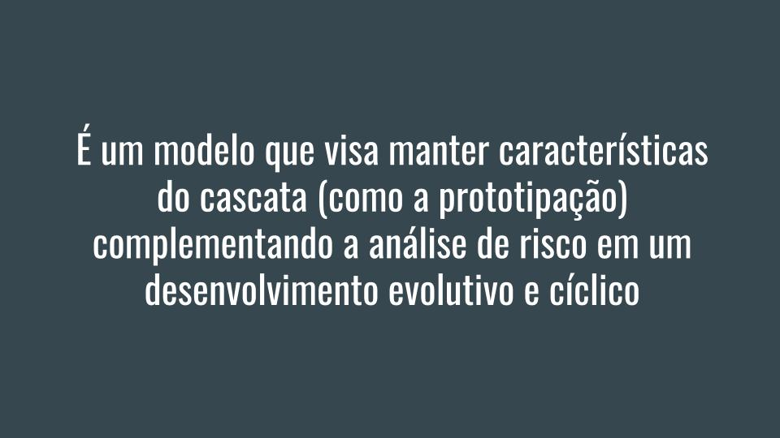
4. 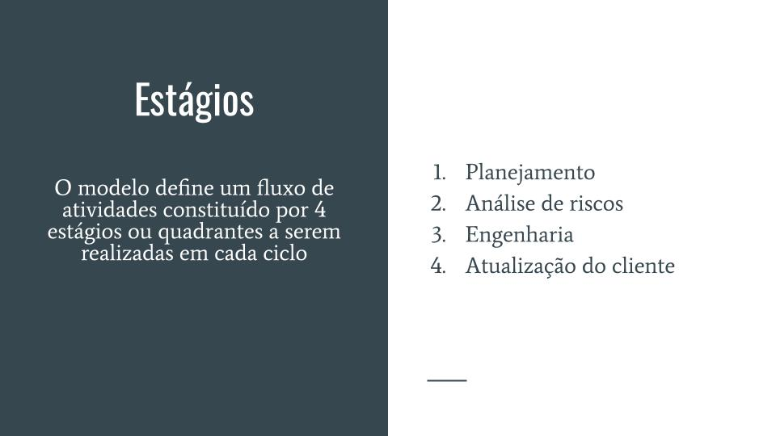
5. 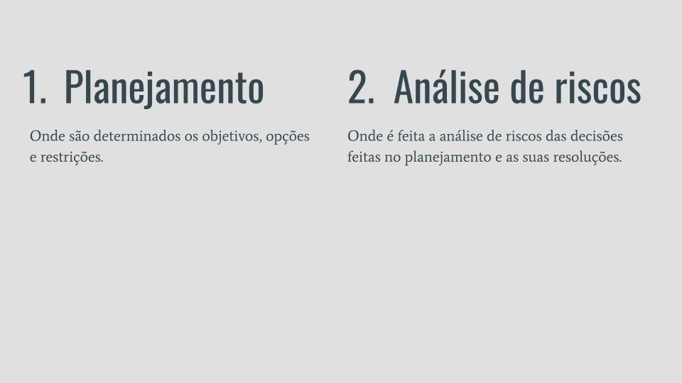
6. 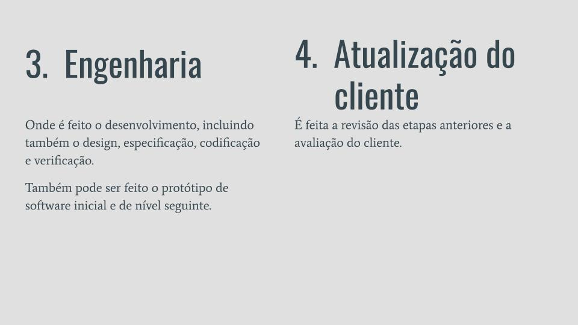
7. 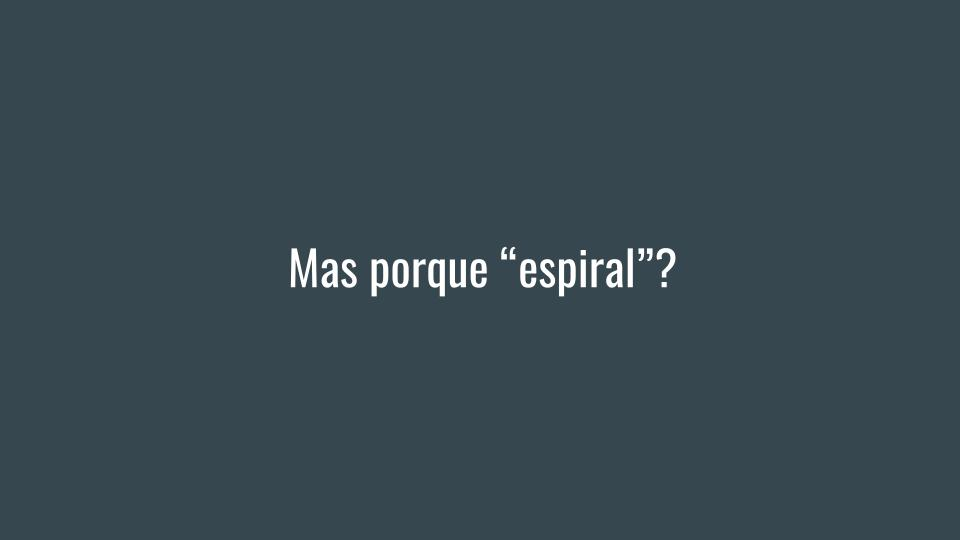
8. 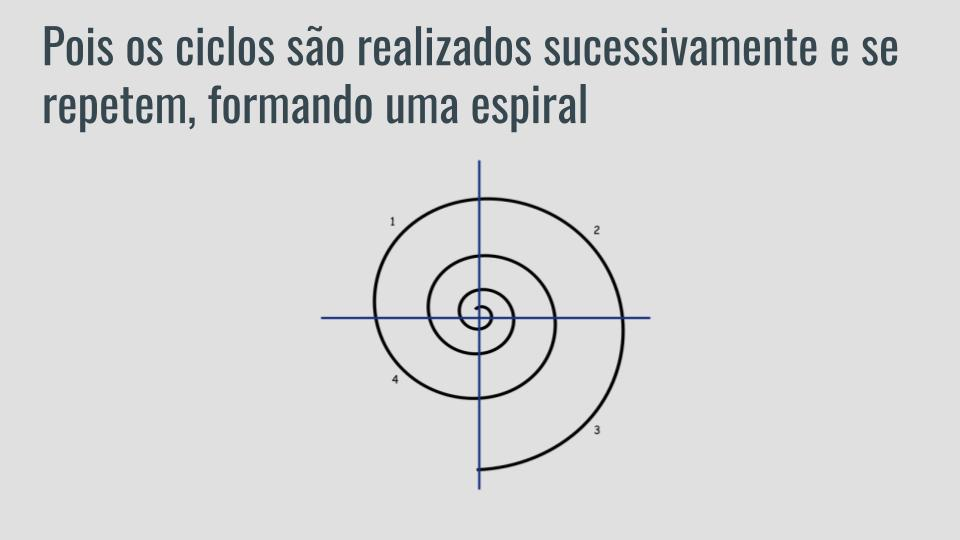
9. 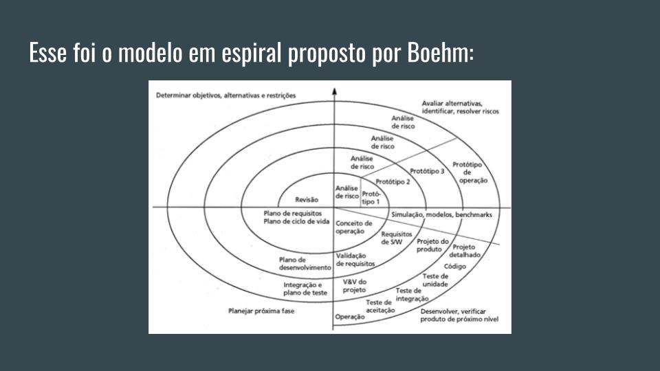
10. 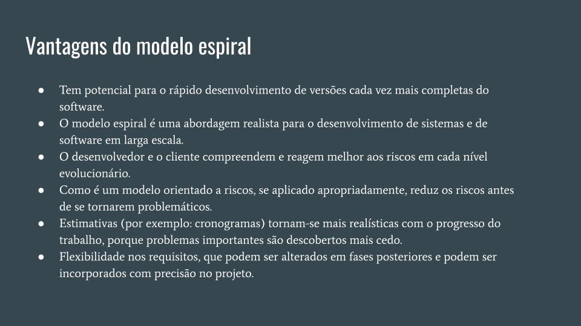
11. 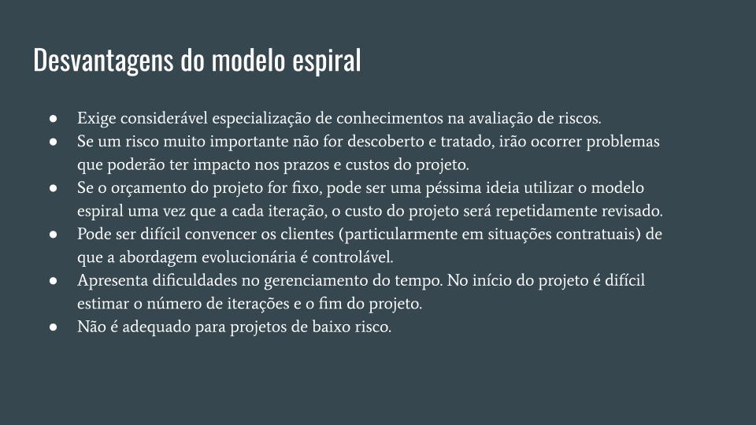
12. 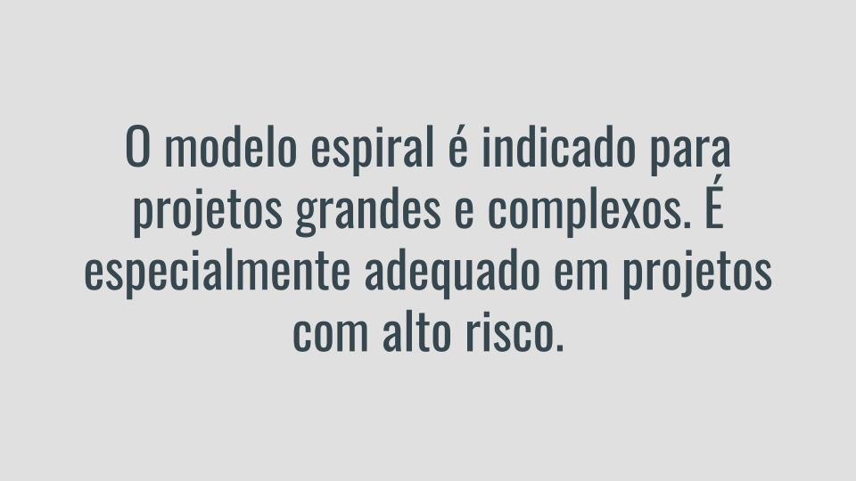
13. 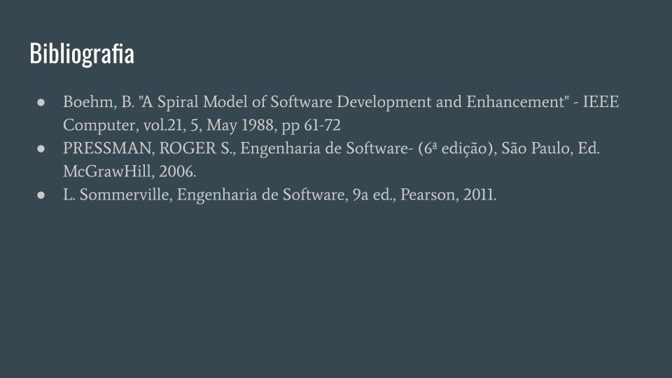

## 2 Entrega da Unidade 2

| Entregas | Links  |
|----|----| 
| Video de apresentação do documento de visão do produto (atualizações com relação a entrega 1) e documento de requisitos | [link](https://www.youtube.com/watch?v=fik7zeygVYo) |
| Documento de requisitos | [link](./documento_de_requisitos.md) |