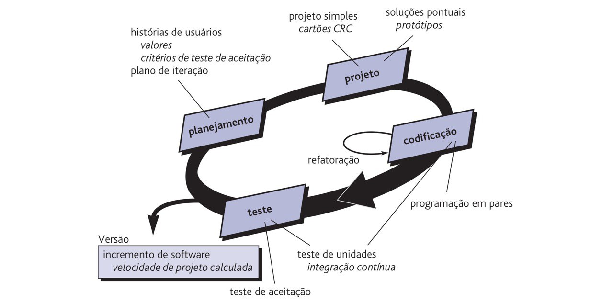

# Visão do Produto e Projeto

## Histórico de revisão

 

| Data | Versão | Descrição | Autor |
| ---- | ---- | ---- | ---- |
| 31/10/22 | 0.1 | Primeiro preenchimento do documento | Beatriz |
| 08/11/22 | 0.2 | Ajustes iniciais sugeridos | Beatriz |
| 15/11/22 | 0.3 | Definição do processo de desenvolvimento | Pedro, Guilherme, Mário, Beatriz, Israel |
| 29/12/22 | 0.4 | Correção issues #1, #2 e #3 | Beatriz |
| 29/12/22 | 0.5 | Correção issues #3, #4 e #5 | Pedro |
| 30/12/22 | 0.6 | Correção issue #6 | Beatriz |

 

## 1 Visão Geral do Produto

O Strix é um produto voltado aos profissionais de educação física que trabalham como Personal Trainers, principalmente os autônomos, mas também pode ser usado pelos que trabalham em alguma academia. É um sistema para a gestão geral do profissional nas suas atividades, possuindo funcionalidades como calendário para marcação de aulas, cadastro de alunos, controle de pagamentos recebidos, envio de planejamento de treino para os alunos entre outros. 

O diferencial comparado a outros produtos disponíveis é a gratuidade independente da quantidade de alunos registrados e a oportunidade de fazer uma gestão completa do negócio em uma única ferramenta (da gestão financeira, de agenda, de alunos e de treinos). Se o cliente procura uma ferramenta para se organizar sem custo algum,  de fácil utilização e com tudo que precisa em um lugar só, esse é o sistema ideal pra ele!

### 1.1 Declaração de Posição do Produto

|  |  | 
| ---- | ---- |
| Para | Personal Trainers |
| Quem | Trabalha com vários clientes diferentes e precisa gerenciar seu negócio |
| O Strix | É um Sistema web de gestão |
| Que | Permite o preenchimento da agenda de aulas do personal, o cadastro dos alunos com seus dados, o controle de pagamentos recebidos, o cadastro de exercícios, a seleção dos mesmos e o envio automatizado dos treinos |
| Ao contrário | Do Mobitrainer |
| Nosso produto | É totalmente gratuito, não importa quantos alunos o profissional tenha e possibilita uma gestão completa do negócio |

### 1.2 Objetivos do Produto
O STRIX é um sistema que visa auxiliar o personal trainer a gerir o seu negócio. No mercado hoje existem ferramentas que permitem realizar essa gestão, porém de forma limitada (em relação à quantidade de alunos) e custeada. Nesse cenário, o STRIX chega para oferecer um serviço sem limitações e com zero custo ao personal.

### 1.3 Tecnologias a Serem Utilizadas
Javascript, React, Node.js

 

## 2 Visão Geral do Produto

### 2.1 Organização do Projeto

| Papel| Atribuições | Responsável | Participantes |
|----|----|----|----|
| Tech lead | Codificar o produto, codificar testes unitários, realizar refatoração | Mário | Guilherme, Beatriz, Pedro, Israel |
| Product Owner | Atualizar o escopo do produto, organizar o escopo das sprints, validar as entregas | Beatriz | Guilherme |
| Scrum Master | Garantir que o Time Scrum se oriente pelos valores e práticas do Scrum, certifica-se de que os membros não se comprometam com compromissos além dos que eles conseguem cumprir dentro de uma Sprint. | Guilherme | Mário, Beatriz, Israel, Pedro |
| Analista de Qualidade | Garantir a qualidade das entregas e o cumprimento dos conceitos propostos. | Pedro | Mário, Beatriz, Israel |

### 2.2 Planejamento das Fases e/ou Iterações do Projeto

| Sprint | Produto (entrega) | Data Início | Data Fim |
| ---- | ---- | ---- | ---- |
| Sprint 1 | Definição do Produto | 31/10/2022 | 18/11/2022 |
| Sprint 2 | Definição do Backlog do produto e elicitação de requisitos  | 19/11/2022 | 03/12/2022 |
| Sprint 3 | Criação do protótipo, configuração do ambiente de desenvolvimento e estudo das linguagens | 04/12/2022 | 19/12/2022 |
| Sprint 4 | Implementação das histórias pertencentes à feature 2.1.0 de alunos | 20/12/2022 | 03/01/2023 |
| Sprint 5 | Implementação das histórias pertencentes à feature 4.1.0 de exercícios e 4.2.0 de envio de treino | 04/01/2023 | 18/01/2023 |
| Sprint 6 | Implementação das histórias pertencentes à feature 3.1.0 de pendências e 3.2.0 de registro de pagamentos | 19/01/2023 | 02/02/2023 |
| Sprint 7 | Implementação das histórias pertencentes à feature 5.1.0 de login | 03/02/2023 | 09/02/2023 |

### 2.3 Matriz de Comunicação

| Descrição | Área/Envolvidos | Periodicidade | Produtos Gerados |
| ---- | ---- | ---- | ---- |
| Comunicação sobre a situação das atividades executadas no dia | Equipe do Projeto | Diária | Resumo da reunião |
| Acompanhamento das atividades em desenvolvimento | Equipe do Projeto | Quinzenal | Resumo da reunião, validação do atendimento aos requisitos |
| Análise dos riscos, planejamento de próximas atividades | Equipe do Projeto | Quinzenal | Relatório de situação do projeto e resumo da reunião |
| Retrospectiva | Equipe do Projeto | Quinzenal | Relatório sobre situação da equipe e dificuldades |
| Comunicar situação do projeto | Equipe do Projeto, Professor | Semanal | Resumo da reunião e feedback do professor |
| Reunião com o cliente | Equipe do Projeto, cliente | Quinzenal | Feedback do cliente, refinamento de requisitos |

### 2.4 Gerenciamento de Riscos 
Os riscos identificados são:

* Falta de afinidade com a linguagem de programação escolhidada
* Falta de organização com as entregas a serem feitas
* Falhas na comunicação e alinhamento entre os integrantes 
* Falta de tempo para se dedicar ao projeto devido há outras demandas externas

As ações a serem tomadas para a mitigação dos mesmos são:

* Escolher linguagens que facilitem a programação do grupo e estudá-las 
* Estar sempre atentos as datas de entregas e o que deve ser entregue em cada uma delas
* Sempre informar ao grupo coisas importantes e compreender o que os membros estão informando
* Organização pessoal e informar ao grupo qualquer impedimento

### 2.5 Critério de Replanejamento
O grupo deve se replanejar caso haja:

* Atraso em alguma tarefa a ser realizada, devendo realocá-la no próximo ciclo
* Incremento de tarefa a ser realizada, devendo alocá-la em algum dos ciclos 
* Desfalque do grupo, devendo ajustar os ciclos de acordo com a capacidade do time
* Ajuste nas datas, devendo analisar o que deve ser entregue na nova data e rever os ciclos

 

## 3 Processo de Desenvolvimento de Software
Será adotado um ciclo de vida incremental para o processo de desenvolvimento, com ciclos curtos e iterativos, adotando também algumas propriedades do XP e do SCRUM, processos escolhidos pois o cliente tem disponibilidade, os requisitos ainda estão sendo descobrertos e moldados e as entregas possuem prazos já delimitados, indicando assim o XP, e será necessário que ocorra uma gestão de projeto correspondente com a do Scrum. O detalhamento das práticas de cada processo adotado serão explanadas nos itens 3.1 e 3.2. Utilizaremos de um Product Backlog e Sprint Backlog para o planejamento, com procedimentos do processo ágil como: Sprint planning, Spring Review, com Pair Programming e Planning Poker.

### 3.1 XP (Extreme Programming)
O XP é um método ágil de desenvolvimento de software criado no final da década de 90 que se baseia na criação de sistemas de alta qualidade com base em princípios e práticas tais como interação próxima do cliente, testagem constante do código, ciclos curtos de desenvolvimento, programação em pares e ritmo sustentável de desenvolvimento, por exemplo. No XP os requisitos são expressos na forma de histórias de usuários, que refletem as características que devem ser implementadas no sistema. Essas histórias serão divididas em uma série de tarefas que devem ser cumpridas em cada sprint.

Processo de desenvolvimento do XP (Pressman)

#### 3.1.1 Práticas adotadas do XP 

- Pair Programming: Dois programadores trabalham juntos em uma máquina onde um codifica e o outro acompanha, fazendo críticas e dando sugestões. Os pares trocam de lugar periodicamente. 

- Ritmo Sustentável: Será adotado um ritmo de trabalho aceitável que não sobrecarrege a equipe de desenvolvimento, já que horas-extra de trabalho impactam na qualidade do código e na produtividade da equipe a longo prazo.

- Projeto Simples: Adoção de um projeto simples capaz de passar nos testes, que não possua duplicidade de funções, que seja fácil de refatorar e de implementar novas funcionalidades. 

- Refatoração: Ocorrerá manutenções periódicas no código onde podem ser feitas melhorias sem alteração das funcionalidades do sistema (refatoração), melhorando a qualidade do código.

- Testes: Serão implementados testes unitários, de integração e de aceitação. 

- Integração Contínua: Consiste em integrar o trabalho diversas vezes ao dia, assegurando que a base de código permaneça consistente ao final de cada integração.

### 3.2 Scrum
Segundo o Scrum Guide, o Scrum, criado no início dos anos 90, é "um framework leve que ajuda pessoas, times e organizações a gerar valor por meio de soluções adaptativas para problemas complexos." Ele sugere uma série de eventos a serem realizados que são "projetados especificamente para permitir a transparência necessária", segundo o Guide, e "cada evento [...] é uma oportunidade formal para inspecionar e adaptar os artefatos do Scrum". 

#### 3.2.1 Eventos adotados do Scrum

- Sprint: Será adotada a sprint quinzenal com o planejamento descrito no ite. 2.2.

- Sprint planning: Será feito o planejamento da sprint antes do início da mesma quinzenalmente.

- Daily: Ocorrerá diariamente por meio da conversa entre os mesmos do grupo para informarem seus feitos, planejamentos e impedimentos

- Sprint review: Ocorrerá a cada final de sprint para os integrantes mostrarem e revisarem o que foi trabalhado durante a sprint a ser finalizada.

- Sprint retrospective: Ocorrerá quinzenalmente ao final de cada sprint para serem levantados os aspectos de melhorias da equipe, afim de melhorar a sua qualidade de desenvolvimento.

### 3.3 Atividades

#### 3.3.1 Sprint Planning

| Atividade | Método | Ferramenta | Entrega |
| ---- | ---- | ---- | ---- |
| Elicitação de requisitos | Brainstorming, Construção de User Story | Meets, Trello e Whatsapp | Levantamento das atividades a serem desenvolvidas e suas prioridades. | 
| Validação e Verificação | Brainstorming, reunião com cliente | Meets e Whatsapp | Alinhamento das atividades levantadas ao objetivo do produto/MVP |

#### 3.3.2 Sprint

| Atividade | Método | Ferramenta | Entrega |
| ---- | ---- | ---- | ---- |
| Construção/Refinamento de protótipo | Prototipação | Figma | Desenvolvimento de protótipo com base nas atividades elicitadas no backlog. | 
| Desenvolvimento de atividades | Pair Programming | VSCode, Webstorm IDE | Incrementos no produto com base nas atividades elicitadas. |
| Testes e garantia de qualidade | Testes unitários e Testes Manuais | VSCode, Webstorm IDE | codificação de testes unitários para assegurar a qualidade, e testes manuais para garantir funcionamento da interface. |

#### 3.3.3 Sprint Review

| Atividade | Método | Ferramenta | Entrega |
| ---- | ---- | ---- | ---- |
| Análise de progresso | Apresentação | Meets | Identificação do progresso obtido durante a sprint e validação em relação aos requisitos. | 

#### 3.3.4 Sprint Retrospective

| Atividade | Método | Ferramenta | Entrega |
| ---- | ---- | ---- | ---- |
| Avaliação da equipe | Brainstorming | Meets | Reorganização da equipe com relação às dificuldades encontradas ao longo da sprint. |

 

## 4 Lições aprendidas

### 4.1 Unidade 1

A equipe aprendeu que, diante da falha de comunicação, era necessário um maior comprometimento dos integrantes quanto a comunicação ativa no grupo do time, e que diante do que estaria por vir nas próximas sprints no que diz respeito ao desenvolvimento do sistema, também era necessário um aprofundamento em relação às metodologias a serem utilizadas e estudo das técnologias.

Esses aprendizados são relevantes, pois sem uma comunicação efetiva as coisas não fluem bem na equipe e isso gera problemas, e se o time estiver preparado tecnicamente o desenvolvimento vai correr melhor e os impedimentos quanto a isso serão mitigados.

### 4.2 Unidade 2

A equipe percebeu que com os aprendizados da unidade 1 ela pôde melhorar nas questões apontados. A comunicação ocorreu bem diante dos pontos levantadas no grupo do time, havendo participação ativa dos integrantes e rápida resolução dos problemas. 

O benefício disso é que os integrantes realmente melhoraram suas condutas diante do feedback da unidade anterior permitindo que os ajustes necessários fossem feitos e a equipe crescesse internamente com a cooperação de todos.

## 5 Referências bibliográficas
PRESSMAN, ROGER S., Engenharia de Software- (6ª edição), São Paulo, Ed. McGrawHill, 2006.

L. Sommerville, Engenharia de Software, 9a ed., Pearson, 2011. 
